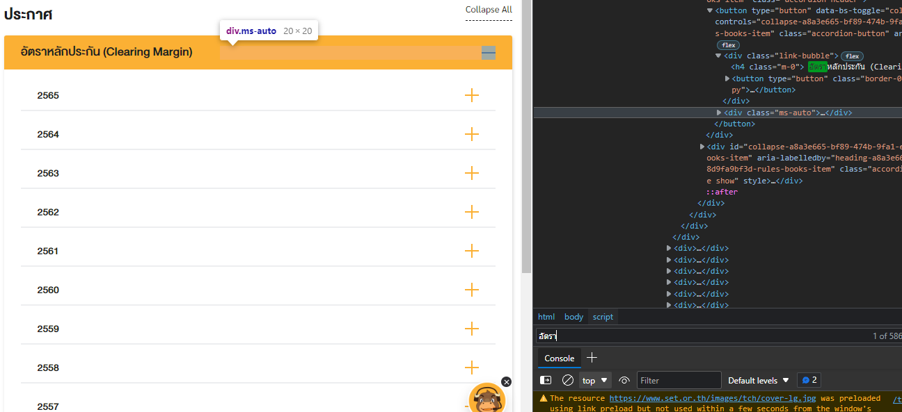
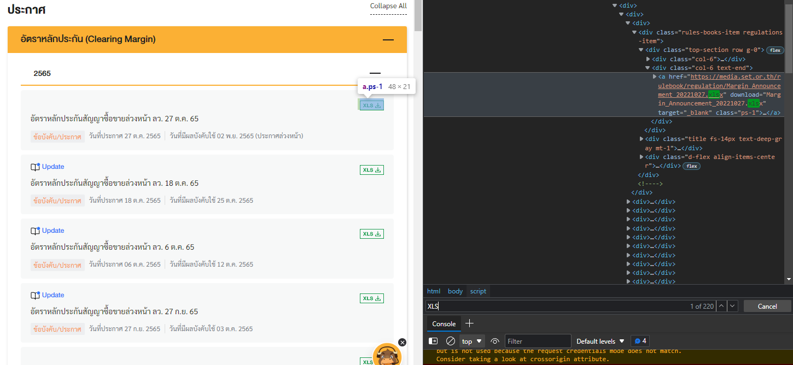
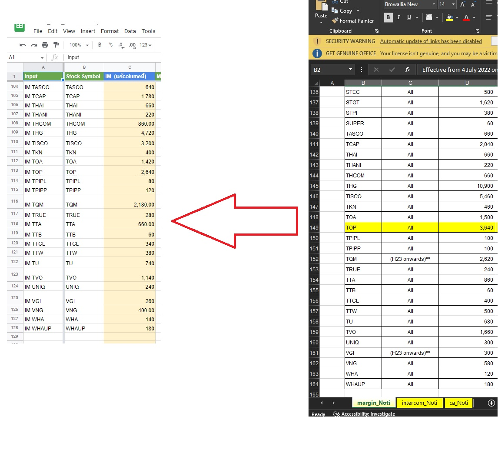
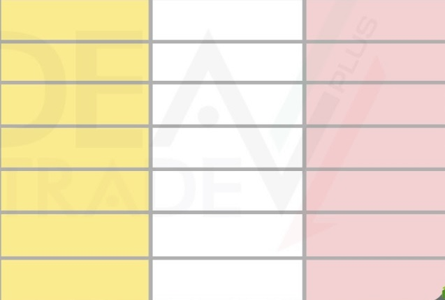
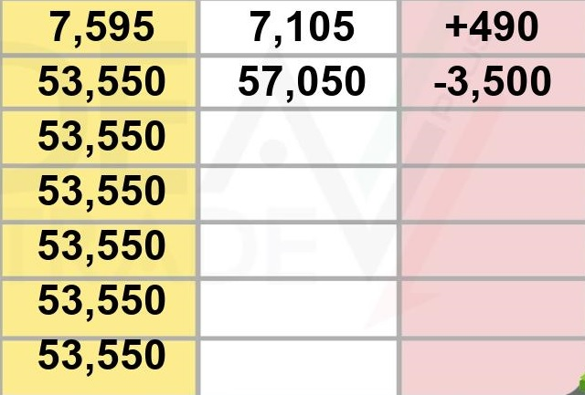
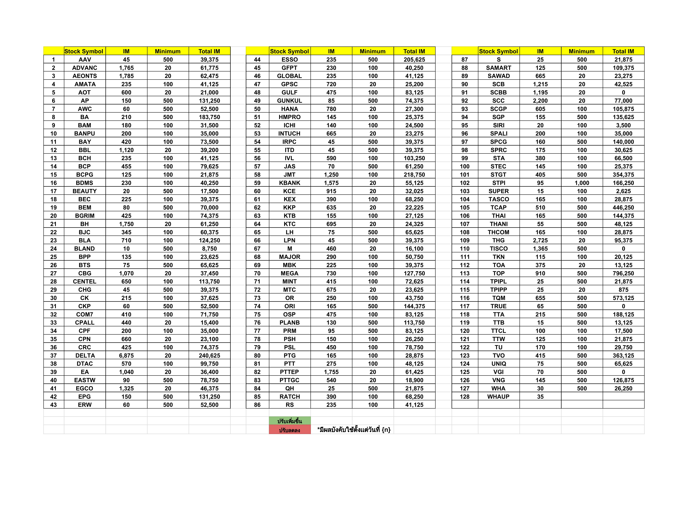

# Initial-margin-rate-auto-update-script-project-API
# NOTE:This project is a practical work I created for the company, hench confidential information are left empty or blurred
The script scrape initial margin rate data from Stock Exchange Of Thailand and excel files to write new data to a desired google sheet via google API and then send a notification to LINE via LINE Notify API.

Additionally, the script also includes a download function to download the google sheet as PDF and a function that converts PDF to JPG for previewing in the LINE message app.

## 1) Scraping download link from hidden HTML element by running selenium webdriver to find javascript hidden element
Scraping a hidden element or scripted element isn't simple. Alternatively, you can use webdriver to actually run the website so javascript elements accessible then once we have activated the element we can then scrape the element. It is to be noted that you should give ample time for the webdriver to load if not the function will return an empty string since the code was forced to execute before the website finished loading 




```
def scrapeHTML_string():
    PATH = 'C:\Program Files (x86)\chromedriver.exe'
    s=Service(PATH)
    options = webdriver.ChromeOptions() 
    options.add_experimental_option("excludeSwitches", ["enable-logging"])
    options.headless = True
    driver = webdriver.Chrome(options=options, service=s)
    url = ("https://www.set.or.th/th/tch/rules-regulations/regulations?fbclid=IwAR06NR4BDsK_1Sl-6QzyzHHuW-sHpgbE8uo6dtF0qGx6Udwo1eolYEvHnRM#noti-margin-rate-2022")
    driver.get(url)
    time.sleep(3)
    soup = BeautifulSoup(driver.page_source, 'lxml')
    time.sleep(3)
    elements = soup.find(class_="rules-books-render-recursive")
    time.sleep(3)
```

    elements_string = str(elements)

    if len(elements_string) > 100:
        # f = open('cacheDebug.txt','w')
        # f.write(elements_string)
        # f.close()
        # print('finished writing file')
        return elements_string
    else:
        print('Error: None Type Detected!')
        return None


    driver.quit()
    

## 2) Downloading Excel then read and write excel data onto google sheets by sending the API request or importing a libary with a request function 
NOTE: API Key from google cloud console are required





## Builtin Function: Auto Image Editor
#Before

#After


## Builtin Function: Download and converting PDF TO JPG sample


